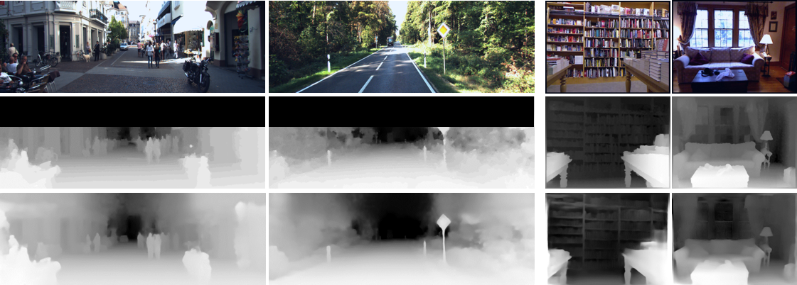

# LapDepth-release (The codes will be uploaded after the submitted paper is accepted)
Monocular Depth Estimation Using Laplacian Pyramid-Based Depth Residuals

### Examples of depth estimation by the proposed method

From top to bottom: input color images, ground truth, and estimation results by the proposed method. Note that left two samples are from the KITTI dataset while right ones belong to the NYU Depth V2 dataset.

### Experimental results with state-of-the art methods on the KITTI dataset

Results of depth estimation on the KITTI dataset. 1st and 8th rows: input color images. 2nd and 9th rows: ground truth. 3rd and 10th rows: results by Godard et al. 4th and 11th rows: results by Kuznietsov et al. 5th and 12th rows: results by Fu et al. 6th and 13th rows: results by Lee et
al. 7th and 14th rows: results by the proposed method.

### Experimental results with state-of-the art methods on the NYU Depth V2 dataset

Results of depth estimation on the NYU Depth V2 dataset. 1st row: input color images. 2nd row: ground truth. 3rd row: results by Laina et al. 4th row: results by Fu et al. 5th row: results by Lee et al. 6th row: results by the proposed method.

